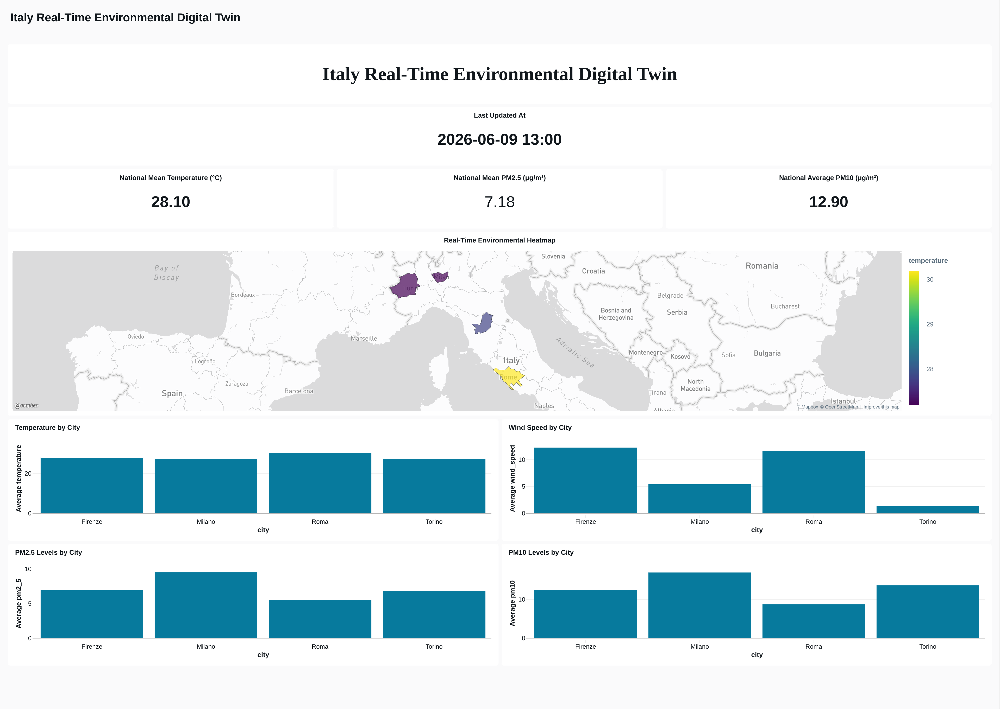

# 🇮🇹 Italy Real-Time Environmental Digital Twin

## 📌 Project Overview
This project is an automated, self-healing Data Engineering pipeline built on the **Databricks Lakehouse Platform**. It ingests real-time Weather and Air Quality data for major Italian cities (Rome, Milan, Turin, Florence) and processes it through a **Medallion Architecture**, topped with a governed **Metric Layer**, to power a live "Digital Twin" monitoring dashboard.

## 🏗️ Architecture & Data Flow
The pipeline utilizes **Databricks Delta Live Tables (DLT)** and declarative PySpark to orchestrate a Bronze-Silver-Gold data flow, culminating in a governed semantic layer for BI consumption.

### 1. Ingestion (The Fetcher)
* A Python script runs via Databricks Workflows every 15 minutes.
* Fetches live telemetry from the Open-Meteo API.
* Lands raw JSON payload into Databricks Unity Catalog Volumes.

### 2. Bronze Layer (Raw Data)
* Built using **Databricks Auto Loader (`cloudFiles`)**.
* Incrementally streams new JSON files into Delta tables.
* Implements `schemaEvolutionMode = "rescue"` to prevent pipeline crashes if the upstream API schema changes.
* Adds ingestion timestamps and metadata for lineage tracking.

### 3. Silver Layer (Cleaned & Deduplicated)
* Utilizes DLT **Streaming Views** to unnest complex JSON structures and cast data types on the fly.
* Enforces Data Quality using DLT expectations (`@dp.expect_or_drop`).
* Implements **Change Data Capture (CDC)** using `dp.create_auto_cdc_flow`.
* **SCD Type 1 logic:** Ensures the target table maintains only the *single latest* environment state per city, resolving conflicts using the ingestion timestamp.

### 4. Gold Layer (Data Marts)
* A **Materialized View** that joins the deduplicated Weather and Air Quality Silver tables.
* Creates a clean, highly optimized denormalized table representing the core "City Environment" entity.

### 5. Semantic / Metric Layer (Governed Business Logic)
* Centralizes and governs KPI definitions.
* Pre-calculates national averages and environmental thresholds *in code* rather than in the BI tool.
* Ensures that downstream dashboards, ad-hoc queries, and AI/BI tools consume uniform, consistent metrics without risking fragmented logic across different reports.

## 🛠️ Tech Stack
* **Platform:** Databricks (Lakeflow / Unity Catalog)
* **Compute:** Serverless DLT Pipeline / Job Clusters
* **Languages:** PySpark, Python, Databricks SQL
* **Frameworks:** Delta Live Tables (DLT), Structured Streaming
* **Architecture:** Medallion Architecture, Semantic Layer
* **Visualization:** Databricks SQL Dashboards
* **Source API:** Open-Meteo

## 🚀 Key Engineering Highlights
* **Governed BI Consumption:** By decoupling the Metric Layer from the BI tool, the pipeline ensures a "single source of truth" for complex environmental KPIs, making the data instantly ready for GenAI text-to-SQL querying.
* **Decoupled Ingestion:** API fetching is isolated from Spark processing. If the API goes down, the Spark pipeline doesn't fail; it just waits for new files.
* **Cost Optimized:** Used `@dp.view` instead of `@dp.table` for intermediate flattening steps to prevent writing unnecessary data to cloud storage.
* **Idempotent & Resilient:** The CDC sequence logic ensures that even if the pipeline needs to be fully refreshed or re-run, it will accurately rebuild the correct current state without duplicating records.